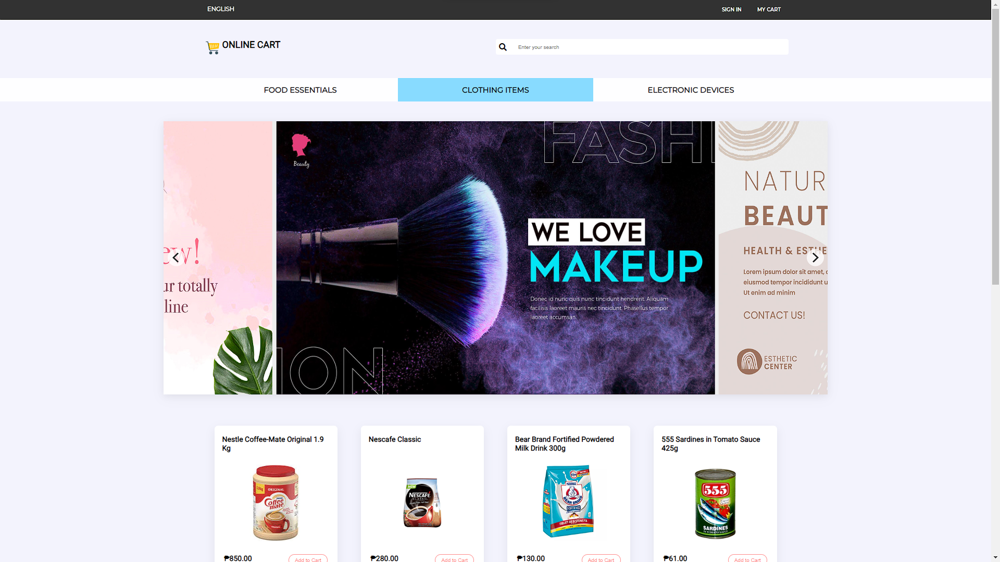
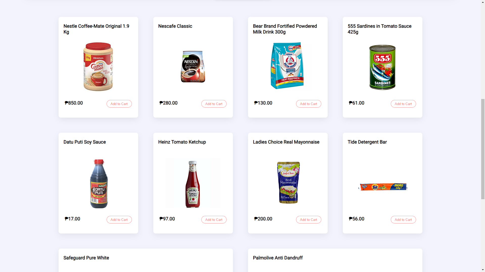
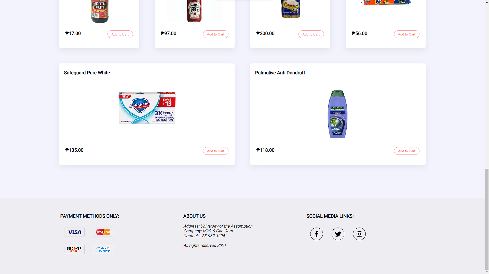
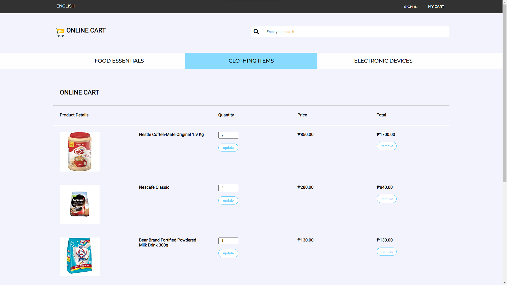
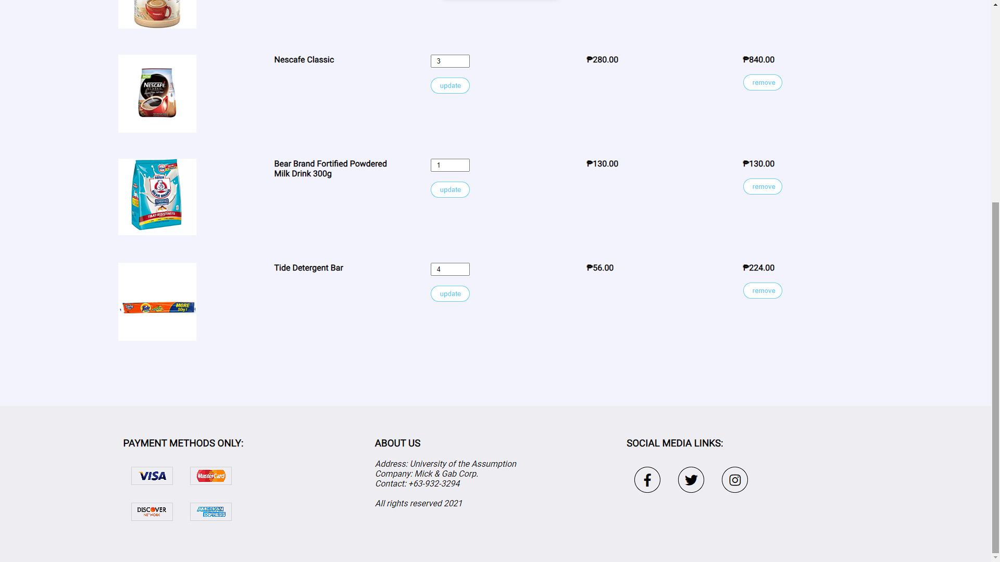

# PHP Online Shopping Cart



## About

The PHP Shopping Cart Project is a simple yet powerful e-commerce solution that focuses on the fundamental feature of adding items to the shopping cart. This project allows customers to seamlessly browse products, select items they wish to purchase, and add them to their cart for a smooth shopping experience.

## How to use?

#### 1. Install XAMPP (along with php).

#### 2. Open XAMPP, and run both apache server and mysql.

#### 3. Open a browser and visit this phpmyadmin link [http://localhost/phpmyadmin/](http://localhost/phpmyadmin/).

#### 4. Create a database name "dbsc".

#### 5. Now go inside the dbsc database in phpmyadmin, insert and run this sql.
```
-- phpMyAdmin SQL Dump
-- version 5.2.0
-- https://www.phpmyadmin.net/
--
-- Host: 127.0.0.1
-- Generation Time: Sep 18, 2023 at 09:48 AM
-- Server version: 10.4.27-MariaDB
-- PHP Version: 8.1.12

SET SQL_MODE = "NO_AUTO_VALUE_ON_ZERO";
START TRANSACTION;
SET time_zone = "+00:00";


/*!40101 SET @OLD_CHARACTER_SET_CLIENT=@@CHARACTER_SET_CLIENT */;
/*!40101 SET @OLD_CHARACTER_SET_RESULTS=@@CHARACTER_SET_RESULTS */;
/*!40101 SET @OLD_COLLATION_CONNECTION=@@COLLATION_CONNECTION */;
/*!40101 SET NAMES utf8mb4 */;

--
-- Database: `dbsc`
--

DELIMITER $$
--
-- Procedures
--
CREATE DEFINER=`root`@`localhost` PROCEDURE `DeleteData` (IN `id` INT(11))   BEGIN
	DELETE FROM tblcart WHERE PRODUCT_ID = id;
END$$

CREATE DEFINER=`root`@`localhost` PROCEDURE `EditData` (IN `id` INT(11))   BEGIN
	UPDATE tblcart SET PRODUCT_QUANTITY=PRODUCT_QUANTITY+1 WHERE PRODUCT_ID = id;
END$$

CREATE DEFINER=`root`@`localhost` PROCEDURE `EditDataSecond` (IN `id` INT(11), IN `quantity` INT(11))   BEGIN
	UPDATE tblcart SET PRODUCT_QUANTITY = quantity WHERE PRODUCT_ID = id;
END$$

CREATE DEFINER=`root`@`localhost` PROCEDURE `InsertData` (IN `id` INT(11), IN `name` TEXT, IN `price` INT(11), IN `quantity` INT(11), IN `image` TEXT)   BEGIN
	INSERT INTO tblcart (PRODUCT_ID, PRODUCT_NAME, PRODUCT_PRICE, PRODUCT_QUANTITY, PRODUCT_IMAGE) VALUES(id, name, price, quantity, image);
END$$

CREATE DEFINER=`root`@`localhost` PROCEDURE `SearchData` (IN `name` TEXT)   BEGIN
	SELECT * FROM tblproducts WHERE PRODUCT_NAME LIKE CONCAT('%', name , '%');
END$$

CREATE DEFINER=`root`@`localhost` PROCEDURE `SearchOrderCart` (IN `productID` INT(11))   BEGIN
	SELECT PRODUCT_ID FROM tblcart WHERE PRODUCT_ID = productID LIMIT 1;
END$$

CREATE DEFINER=`root`@`localhost` PROCEDURE `ShowOrder` ()   BEGIN
	SELECT * FROM tblcart;
END$$

CREATE DEFINER=`root`@`localhost` PROCEDURE `ShowProducts` ()   BEGIN
	SELECT * FROM tblproducts;
END$$

DELIMITER ;

-- --------------------------------------------------------

--
-- Table structure for table `tblcart`
--

CREATE TABLE `tblcart` (
  `PRODUCT_ID` int(11) NOT NULL,
  `PRODUCT_NAME` varchar(255) NOT NULL,
  `PRODUCT_PRICE` decimal(10,0) NOT NULL,
  `PRODUCT_QUANTITY` int(11) NOT NULL,
  `PRODUCT_IMAGE` varchar(255) NOT NULL
) ENGINE=InnoDB DEFAULT CHARSET=utf8mb4 COLLATE=utf8mb4_general_ci;

--
-- Dumping data for table `tblcart`
--

INSERT INTO `tblcart` (`PRODUCT_ID`, `PRODUCT_NAME`, `PRODUCT_PRICE`, `PRODUCT_QUANTITY`, `PRODUCT_IMAGE`) VALUES
(1, 'Nestle Coffee-Mate Original 1.9 Kg', '850', 1, 'nestle-coffee-mate.jpg'),
(2, 'Nescafe Classic', '280', 2, 'nescafe-classic.jpg'),
(3, 'Bear Brand Fortified Powdered Milk Drink 300g', '130', 1, 'bear-brand-fortified.jpg'),
(8, 'Tide Detergent Bar', '56', 4, 'tide-detergent-bar.jpg');

-- --------------------------------------------------------

--
-- Table structure for table `tblproducts`
--

CREATE TABLE `tblproducts` (
  `PRODUCT_ID` int(11) NOT NULL,
  `PRODUCT_NAME` varchar(255) NOT NULL,
  `PRODUCT_PRICE` decimal(10,0) NOT NULL,
  `PRODUCT_IMAGE` varchar(255) NOT NULL
) ENGINE=InnoDB DEFAULT CHARSET=utf8mb4 COLLATE=utf8mb4_general_ci;

--
-- Dumping data for table `tblproducts`
--

INSERT INTO `tblproducts` (`PRODUCT_ID`, `PRODUCT_NAME`, `PRODUCT_PRICE`, `PRODUCT_IMAGE`) VALUES
(1, 'Nestle Coffee-Mate Original 1.9 Kg', '850', 'nestle-coffee-mate.jpg'),
(2, 'Nescafe Classic', '280', 'nescafe-classic.jpg'),
(3, 'Bear Brand Fortified Powdered Milk Drink 300g', '130', 'bear-brand-fortified.jpg'),
(4, '555 Sardines in Tomato Sauce 425g', '61', '555-sardines.jpg'),
(5, 'Datu Puti Soy Sauce', '17', 'datu-puti-soy.jpg'),
(6, 'Heinz Tomato Ketchup', '97', 'heinz-tomato-ketchup.jpg'),
(7, 'Ladies Choice Real Mayonnaise', '200', 'ladies-choice-real.jpg'),
(8, 'Tide Detergent Bar', '56', 'tide-detergent-bar.jpg'),
(9, 'Safeguard Pure White', '135', 'safeguard-pure-white.jpg'),
(10, 'Palmolive Anti Dandruff', '118', 'palmolive-anti-dundruff.jpg');

--
-- Indexes for dumped tables
--

--
-- Indexes for table `tblcart`
--
ALTER TABLE `tblcart`
  ADD PRIMARY KEY (`PRODUCT_ID`);

--
-- Indexes for table `tblproducts`
--
ALTER TABLE `tblproducts`
  ADD PRIMARY KEY (`PRODUCT_ID`);

--
-- AUTO_INCREMENT for dumped tables
--

--
-- AUTO_INCREMENT for table `tblcart`
--
ALTER TABLE `tblcart`
  MODIFY `PRODUCT_ID` int(11) NOT NULL AUTO_INCREMENT, AUTO_INCREMENT=11;

--
-- AUTO_INCREMENT for table `tblproducts`
--
ALTER TABLE `tblproducts`
  MODIFY `PRODUCT_ID` int(11) NOT NULL AUTO_INCREMENT, AUTO_INCREMENT=11;
COMMIT;

/*!40101 SET CHARACTER_SET_CLIENT=@OLD_CHARACTER_SET_CLIENT */;
/*!40101 SET CHARACTER_SET_RESULTS=@OLD_CHARACTER_SET_RESULTS */;
/*!40101 SET COLLATION_CONNECTION=@OLD_COLLATION_CONNECTION */;
```

#### 3. Clone the repo.
```sh
$ git clone https://github.com/GabrielSalangsang013/php-online-shopping-cart.git
```

#### 4. Go to the xampp\htdocs folder and place the php-online-shopping-cart folder (project folder).

#### 5. Open a browser, and visit [http://localhost/php-online-shopping-cart](http://localhost/php-online-shopping-cart).

### MORE IMAGES







